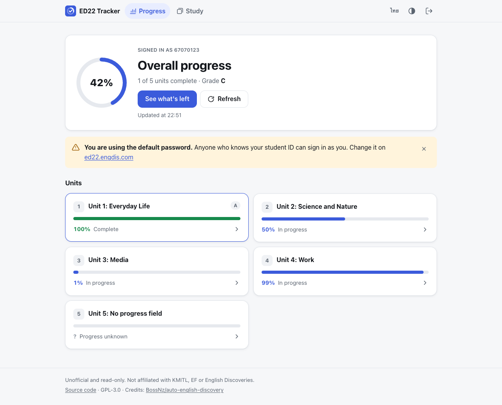
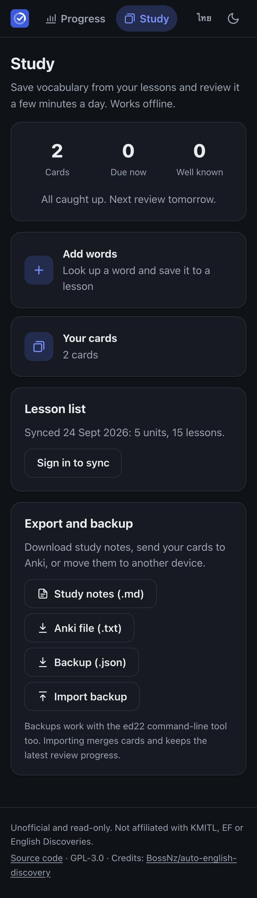
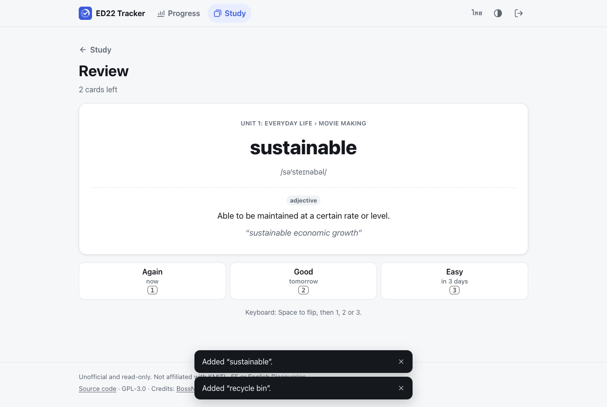

# ED22 Tracker

[](https://github.com/Jesselpetry/ed22-tracker/actions/workflows/ci.yml)

A read-only progress dashboard and vocabulary trainer for **KMITL English Discoveries (ED22)**, the FE1/FE2 e-learning portal at `ed22.engdis.com/thai`. Use it as a website or from the terminal.

- **Progress:** overall percentage and grade, every unit, and exactly which lessons and steps (Explore, Practice, Test) are left.
- **Study:** save words from each lesson with a built-in dictionary lookup, review them with spaced repetition, and export study notes or an Anki deck. Works offline.
- **Safe by design:** it cannot mark anything complete, submit answers or read answer data. Your password goes straight to ED22 and is never stored. See [SECURITY.md](SECURITY.md).

<p>
  
  
</p>


> Screenshots use synthetic demo data.

## ภาษาไทย

เว็บและโปรแกรมสำหรับดูความคืบหน้าวิชา English Discoveries (FE1/FE2) ของ สจล. แบบอ่านอย่างเดียว เห็นว่ายังเหลือบทเรียนไหน ขั้นตอนไหน และมีระบบทบทวนคำศัพท์ (แฟลชการ์ด) ที่ใช้งานออฟไลน์ได้ รหัสผ่านส่งตรงจากเบราว์เซอร์ไปยัง ED22 เท่านั้น ไม่มีเซิร์ฟเวอร์กลาง ไม่เก็บรหัสผ่าน และไม่สามารถทำบทเรียนหรือส่งคำตอบแทนได้ หน้าเว็บรองรับทั้งภาษาไทยและภาษาอังกฤษ

## Features

| | Web app | CLI (`ed22`) |
| --- | --- | --- |
| Overall progress, grade, per-unit bars | ✓ | ✓ |
| Lesson × step breakdown, "to do" filter | ✓ | ✓ |
| Everything left to do, across all units | ✓ | ✓ |
| Add words with dictionary lookup, tagged by lesson | ✓ | ✓ |
| Spaced-repetition review (keyboard: Space, 1/2/3) | ✓ | ✓ |
| Export Markdown study notes / Anki deck | ✓ | ✓ |
| Backup and restore cards (same JSON in both) | ✓ | ✓ |
| Thai / English interface, light / dark theme | ✓ | English |
| JSON output for scripts | | ✓ |

## Quick start

Requires Node.js 22 or newer.

```bash
git clone https://github.com/Jesselpetry/ed22-tracker.git
cd ed22-tracker
npm install
```

**Web app** (local development):

```bash
npm run dev          # http://localhost:5173
```

**CLI:**

```bash
npm run cli              # interactive dashboard
npm run cli -- study     # flashcards and study notes
npm run cli -- --help

# optional: install the `ed22` command globally
cd packages/cli && npm link
```

### CLI reference

| Command / option | What it does |
| --- | --- |
| `ed22` | Interactive dashboard (plain summary when piped) |
| `ed22 study` | Flashcards and study notes; works offline |
| `ed22 logout` | End the ED22 session and delete the saved token |
| `--json` | Print progress as JSON and exit |
| `--fresh` | Ignore the saved session and sign in again |
| `--no-save` | Keep the session token in memory only |
| `--dump` | Save raw API responses to `./ed22-raw.json` (debugging) |

For scripts, put `ED22_USERNAME` and `ED22_PASSWORD` in `packages/cli/.env` (see `.env.example`; the file is git-ignored). Otherwise the CLI asks, with the password masked.

## How it works

```
packages/core   Shared, platform-agnostic logic: ED22 client with read-only allowlist,
                progress model, spaced repetition, dictionary lookup, exports
packages/cli    Terminal app (Node): prompts, tables, token file, deck.json
apps/web        Static React app (Vite): no backend, talks to ED22 from the browser
```

ED22's API allows cross-origin requests, so the web app needs no server of its own: the browser signs in to ED22 directly. The site's Content Security Policy only lets the page connect to ED22 and the dictionary API.

## Development

| Script | What it does |
| --- | --- |
| `npm run dev` | Web app dev server |
| `npm run build` | Production build to `apps/web/dist` |
| `npm test` | Unit tests for all packages (Node's built-in runner) |
| `npm run lint` | ESLint, including React hooks rules |
| `npm run e2e -w @ed22/web` | Builds the app against a mock ED22 and drives it in Chrome |
| `npm run check` | Lint + tests + build |

Tests never contact the real ED22: they use synthetic fixtures in `packages/core/test/fixtures` and a local mock server.

## Deploying

See [docs/DEPLOY.md](docs/DEPLOY.md). In short: a manual GitHub Actions workflow publishes `apps/web/dist` to GitHub Pages after lint, tests and the browser test pass. Any other static host works too.

## Known limitations

- ED22 has no public API documentation. Per-lesson progress is read from each node's `Progress` field; if something shows `?`, run `ed22 --dump` and check the raw data.
- Signing in ends ED22 sessions in other browser tabs (ED22's `ForceLogin`). Saved sessions avoid signing in again.
- Dictionary lookups use the free [Dictionary API](https://dictionaryapi.dev/). When it is unavailable, you type the meaning yourself.

## Credits

- **[BossNz/auto-english-discovery](https://github.com/BossNz/auto-english-discovery)** by [BossNz](https://github.com/BossNz): the original research into the English Discoveries API this project builds on (endpoints, the KMITL institution ID, the course-tree structure and progress rounding).
- [DeltaLoam/auto-english-discovery](https://github.com/DeltaLoam/auto-english-discovery), a fork of BossNz's project, for the 2026 ED22 endpoint updates.

This is a separate, read-only project and contains no automation code from them.

## Disclaimer

Unofficial. Not affiliated with, or endorsed by, KMITL, EF or English Discoveries. Use it with your own account only and follow your institution's rules.

## License

[GPL-3.0](LICENSE), the same license as the upstream project.
